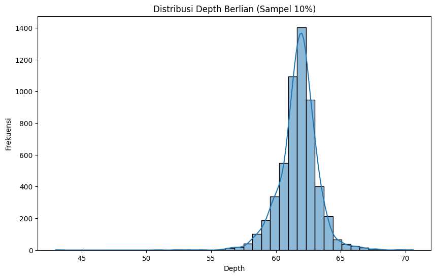

# Tugas 5

## Analisis dengan pyspark
Program yang dibutuhkan :
- Google Colab
- Pyspark
- Seabron
- Matplotlib

### Langkah-langkah
1. Install pyspark `!pip install pyspark findspark -q`
2. Buat Spark session
```py
import findspark
findspark.init()
from pyspark.sql import SparkSession
spark = SparkSession.builder \
 .master("local[*]") \
 .appName("PraktikumStatistikDeskriptif") \
 .getOrCreate()
print(spark)
```
3. Ambil dataset bawaan dari Seaborn
```py
import seaborn as sns
pandas_df = sns.load_dataset('diamonds')
print(f"Jumlah baris di Pandas DF: {len(pandas_df)}")
pandas_df.head()
```
4. Buat Spark dataframe dari pandas dataframe
```py
df = spark.createDataFrame(pandas_df)
df.show(5)
df.printSchema()
```
Isi skema:
```txt
+-----+-------+-----+-------+-----+-----+-----+----+----+----+
|carat|    cut|color|clarity|depth|table|price|   x|   y|   z|
+-----+-------+-----+-------+-----+-----+-----+----+----+----+
| 0.23|  Ideal|    E|    SI2| 61.5| 55.0|  326|3.95|3.98|2.43|
| 0.21|Premium|    E|    SI1| 59.8| 61.0|  326|3.89|3.84|2.31|
| 0.23|   Good|    E|    VS1| 56.9| 65.0|  327|4.05|4.07|2.31|
| 0.29|Premium|    I|    VS2| 62.4| 58.0|  334| 4.2|4.23|2.63|
| 0.31|   Good|    J|    SI2| 63.3| 58.0|  335|4.34|4.35|2.75|
+-----+-------+-----+-------+-----+-----+-----+----+----+----+
```
5. Hitung mean, median (approximate), dan stddev dari kolom carats
```py
from pyspark.sql.functions import mean, stddev
carat_stats = df.select(
    mean("carat").alias("mean_carat"),
    stddev("carat").alias("stddev_carat")
)
carat_stats.show()
median_carat = df.approxQuantile("carat", [0.5], 0.01)
print(f"Median (aproksimasi) carat: {median_carat[0]}")
```
Hasil perhitungan:
```txt
+------------------+------------------+
|        mean_carat|      stddev_carat|
+------------------+------------------+
|0.7979397478679908|0.4740112444054214|
+------------------+------------------+

Median (aproksimasi) carat: 0.7
```
6. Bandingkan rata-rata price untuk berlian dengan color = 'D' vs color = 'J'.
```py
from pyspark.sql.functions import mean

price_by_color = df.filter(df.color.isin("D", "J")) \
    .groupBy("color") \
    .agg(mean("price").alias("avg_price")) \
    .orderBy("color")

price_by_color.show()
```
dari Perhitungan dapat disimpulkan bahwa color 'J' mempunyai harga rata-rata lebih mahal
```txt
+-----+------------------+
|color|         avg_price|
+-----+------------------+
|    D|3169.9540959409596|
|    J|  5323.81801994302|
+-----+------------------+
```
7. Samping kolom 'Depth' dan jadika ke pandas dataframe untuk visualisasi
```py
sampled_depth = df.sample(
    withReplacement=False,
    fraction=0.1,
    seed=42
)
depth_pandas = sampled_depth.select("depth").toPandas()
```
8. Buat histogram dari kolom 'Depth'
```py
import matplotlib.pyplot as plt
import seaborn as sns

plt.figure(figsize=(10,6))
sns.histplot(depth_pandas["depth"], bins=40, kde=True)
plt.title("Distribusi Depth Berlian (Sampel 10%)")
plt.xlabel("Depth")
plt.ylabel("Frekuensi")
plt.show()
```
Hasil : <br>
 <br>
Dapat dilihat bahwa hasil distribusinya mendekati 'Normal' dengan satu puncak utama bukan bimodal
